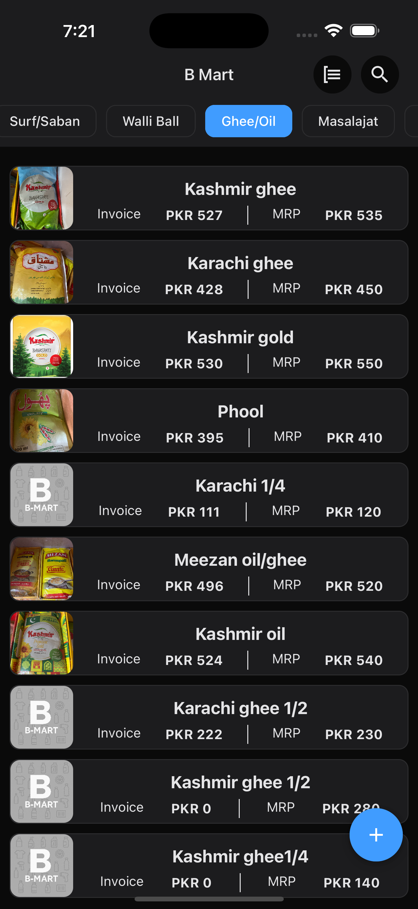
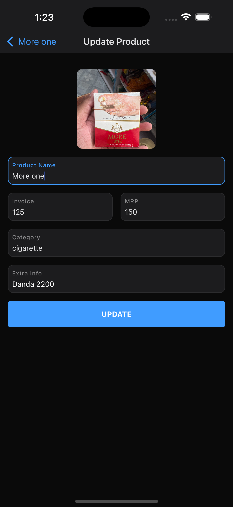

# B-Mart Mobile App

B-Mart is a simple mobile application built with **React Native (Expo)** to manage and view shop products. The app provides a smooth way to browse products, check their details, and update information when needed.

## Features
- **Home Screen** – Displays a list of products with their images, invoice price, and MRP.
- **Search Functionality** – Powered by **Fuse.js** for fast and flexible product search.
- **Product Details Screen** – View complete details of a selected product.
- **Edit/Update Screen** – Update product information easily.

## Tech Stack
- **React Native (with Expo)**
- **Fuse.js** for searching

## 🎥 App Demo
[Watch the demo video](./screenshots/recording.mp4)

## Screenshots
| Home Screen | Product Details | Edit/Update |
|-------------|-----------------|-------------|
|  |  |  |